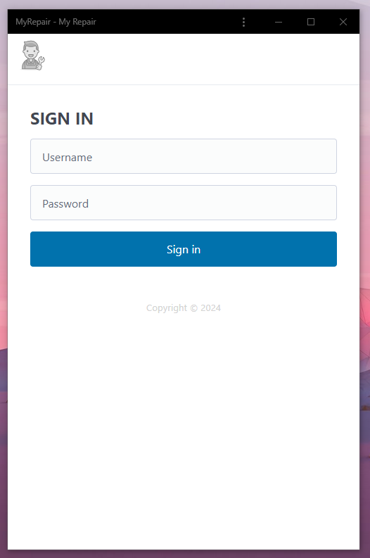
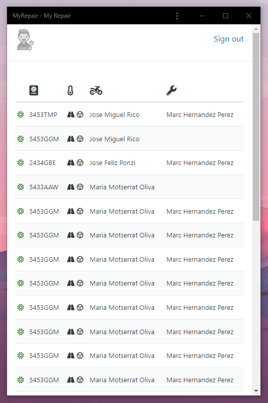

A web app to *elegantly solve* motorbike fleet repairs.

  <a href="https://fabriziotappero.github.io/myRepair/index.html">https://fabriziotappero.github.io/myRepair/index.html</a>

### Frontend
All styling is done in [Pico CSS](https://picocss.com/) and all icons are from [Font Awesome](https://fontawesome.com/icons). 
Javascript is vanilla Javascript and kept to a minimum with [Alpine JS](https://alpinejs.dev/start-here). Future versions of this app 
will probably use [HTMX](https://htmx.org/) running somewhere.

Where Pico CSS is not enough, thre is CSS.

### Backend
[Golang](https://golang.org/) is the preferred language here but for for the first prototyping we are goind to
use the great [PoketBase](https://pocketbase.io/) hosted on [Pokethost.io](https://app.pockethost.io/).

### Current Status

  
  

## Interesting Topics

While developing this app, I faced some interesting problems worth mentioning.

Where to store a token?
https://blog.ropnop.com/storing-tokens-in-browser/

Use AlpineJS for data fetch and table sorting
https://www.raymondcamden.com/2022/05/02/building-table-sorting-and-pagination-in-alpinejs

